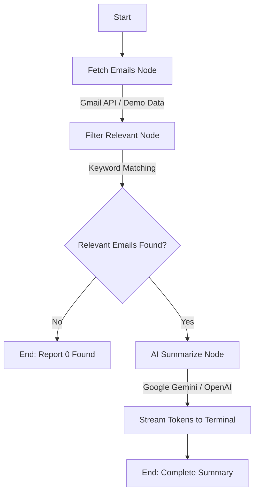

# 📧 Gmail Agent — AI Internship & Placement Email Assistant

An intelligent, state-driven Gmail AI Agent built with **LangGraph**, **Google Gmail API (OAuth 2.0)**, and **Large Language Models (Google Gemini & OpenAI)**. 

It automatically monitors your inbox, discovers internship and campus recruitment emails, eliminates spam/newsletters, and generates concise, structured action summaries streamed in real time to your terminal.

---

## 🌟 Highlights & Features

- ⚡ **Live Token Streaming** — AI summaries stream token-by-token directly to your console for immediate responsiveness.
- 🎯 **Unread-First Inbox Monitoring** — Targets unread emails by default (`is:unread`) so you never miss urgent deadlines.
- 🧹 **Noise & Spam Filtering** — High-precision keyword analysis filters out irrelevant mail, promotions, and general newsletters.
- 📋 **Structured Actionable Summaries** — Automatically extracts:
  - 🏢 **Company / Organization**
  - 🎯 **Role / Program / Event**
  - 💰 **CTC / Stipend / Location**
  - ⏳ **Action Required & Deadlines**
- 🔐 **Secure OAuth 2.0 Authentication** — Direct read-only integration (`gmail.readonly`) with token caching (`token.json`).
- 🎮 **Built-in Demo Mode** — Includes realistic placement & internship sample emails so you can test the pipeline without configuring Google Cloud credentials.
- 🛡️ **Rate-Limit & Quota Protection** — Built-in concurrency control (`asyncio.Semaphore`) and automatic retry backoff to avoid `429 Rate Limit` issues on free tier keys.

---

## 🏗️ Architecture & Workflow



---

## 📋 Prerequisites

- **Python**: `3.11` or higher
- **Package Manager**: [`uv`](https://docs.astral.sh/uv/) (recommended) or `pip`
- **LLM API Key**: [Google AI Studio (Gemini)](https://aistudio.google.com/) or [OpenAI](https://platform.openai.com/)

---

## 🚀 Quick Start Guide

### 1. Clone the Repository & Install Dependencies

```bash
git clone https://github.com/your-username/gmail-agent.git
cd gmail-agent
uv sync
```
*(Or with pip: `pip install -e .`)*

### 2. Configure Environment Variables

Copy the example configuration file:
```bash
cp .env.example .env
```

Open `.env` and add your LLM API key:
```env
# Use Google Gemini (Free & Fast)
GOOGLE_API_KEY=your_gemini_api_key_here

# Or OpenAI
OPENAI_API_KEY=your_openai_api_key_here

# Optional: Override default Gemini model (defaults to gemini-2.5-flash)
# GEMINI_MODEL=gemini-2.5-flash
```

---

## 🔐 Connecting Your Real Gmail Account

To allow the agent to read your Gmail inbox securely:

1. **Create a Google Cloud Project**:
   - Go to [Google Cloud Console](https://console.cloud.google.com/).
   - Click **Create Project** (e.g., `Gmail-Agent`).

2. **Enable the Gmail API**:
   - Navigate to **APIs & Services > Library**.
   - Search for **Gmail API** and click **Enable**.

3. **Configure OAuth Consent Screen**:
   - Go to **APIs & Services > OAuth consent screen**.
   - Select **User Type: External**, fill in app name and your email.
   - Under **Test Users**, add your own Gmail address.

4. **Create OAuth Client ID**:
   - Go to **APIs & Services > Credentials > Create Credentials > OAuth client ID**.
   - Select Application type: **Desktop App**.
   - Name it (e.g., `Gmail Desktop Client`) and click **Create**.
   - Click **Download JSON** and save the file as **`credentials.json`** in the root directory of this project.

5. **Authenticate with Browser**:
   ```bash
   python main.py --auth
   ```
   A browser window will open asking you to sign in with your Google Account and grant read-only access. Upon completion, a secure **`token.json`** will be generated locally.

---

## 💻 Usage & CLI Commands

### 1. Process Unread Emails (Default)
Fetches unread emails matching placement/internship keywords and streams summaries live:
```bash
python main.py
```

### 2. Instant Demo Mode (No Gmail Credentials Needed)
Test the entire LangGraph AI pipeline with realistic sample emails:
```bash
python main.py --demo
```

### 3. Custom Search Queries
Search for specific companies, roles, or topics:
```bash
# Search for Amazon updates
python main.py -q "amazon"

# Search for offer letters
python main.py -q "offer letter"
```

### 4. Search All Emails (Read + Unread)
By default, the agent focuses strictly on unread emails. To search across your entire inbox history:
```bash
python main.py --all
```

### 5. Limit Number of Emails
Limit how many messages to fetch:
```bash
python main.py -m 5
```

### 6. JSON Structured Output
Output results in JSON format for scripts or downstream integration:
```bash
python main.py -f json
```

---

## 📊 Command-Line Options Reference

| Option | Flag | Description | Default |
|---|---|---|---|
| **Query** | `-q, --query <TEXT>` | Custom search filter (e.g., `"Microsoft interview"`) | Default keywords |
| **All Emails** | `--all` | Search all emails (both read and unread) | `False` (Unread only) |
| **Demo Mode** | `--demo` | Run using built-in sample placement emails | `False` |
| **Max Emails** | `-m, --max <INT>` | Maximum number of emails to fetch from Gmail | `10` |
| **Format** | `-f, --format <text\|json>` | Output format (`text` or `json`) | `text` |
| **Auth Setup** | `--auth` | Launch interactive browser login for Gmail OAuth 2.0 | — |

---

## 🖥️ Sample Terminal Output

```text
======================================================================
📧 Gmail Agent - Unread Internship & Placement Summarizer
======================================================================

📬 Found 3 relevant unread emails in Gmail inbox

======================================================================
📋 EMAIL SUMMARIES (STREAMING LIVE)
======================================================================

[1/3] 📧 **Subject: IEEE Global Entrepreneurship Workshop for startup founders**
      _From: "'Director VNest' via CSE 2024 Group" <ccbai24@vitstudent.ac.in> | Date: Sat, 29 Aug 2026 11:52:02 +0530_

* 🏢 **Company / Organization:** IEEE Entrepreneurship & V-NEST (VIT Chennai Startup & Research Foundation)
* 🎯 **Role / Program / Event:** IEEE Global Entrepreneurship Workshop for startup founders
* 💰 **CTC / Stipend / Location:** Minor registration fee (Event funded by IEEE); Location in India
* ⏳ **Action Required & Deadline:** Apply via Smartsheet form by September 20, 2026.
----------------------------------------------------------------------

[2/3] 📧 **Fwd: Encourage Students to Join the SAP Hackfest Hackathon South & East Region 2026**
      _From: "'VITCC Placement' via CSE 2024 Group" <ccbai24@vitstudent.ac.in> | Date: Thu, 27 Aug 2026 16:41:15 +0530_

* 🏢 **Company / Organization:** SAP (in collaboration with SRM & LTM)
* 🎯 **Role / Program / Event:** Hackfest Hackathon South & East Region 2026
* 💰 **CTC / Stipend / Location:** Not mentioned / South & East India (Finale at SRM Chennai)
* ⏳ **Action Required & Deadline:** Enroll in SAP Learning Hub and register by September 6, 2026.
----------------------------------------------------------------------

[3/3] 📧 **Fwd: The Lam Research Challenge 2026 (LRC 3.0) | E-Cell, IIT Bombay**
      _From: "'Vice Chancellor' via CSE 2024 Group" <ccbai24@vitstudent.ac.in> | Date: Wed, 19 Aug 2026 15:42:23 +0530_

* 🏢 **Company / Organization:** Lam Research & T-Works (in association with E-Cell, IIT Bombay)
* 🎯 **Role / Program / Event:** The Lam Research Challenge 2026 (LRC 3.0) — Prototyping challenge
* 💰 **CTC / Stipend / Location:** 1st Prize: ₹5,00,000 + direct internship and full-time hiring opportunities for top 25 teams
* ⏳ **Action Required & Deadline:** Register at https://lrc2026.tworks.in/ by August 26, 2026.
----------------------------------------------------------------------

✅ Total: 3 emails summarized
🕐 Completed at: 2026-09-02 19:24:35
```

---

## 📁 Project Directory Structure

```
gmail-agent/
├── src/
│   └── gmail_agent/
│       ├── __init__.py          # Package initialization & exports
│       ├── agent.py             # LangGraph workflow & LLM summarization
│       ├── gmail_service.py     # Gmail API client & OAuth 2.0 authentication
│       └── main.py              # CLI entry point, argument parsing & streaming
├── main.py                      # Root execution script
├── credentials.json             # Google Cloud OAuth credentials (ignored by git)
├── token.json                   # User session tokens (ignored by git)
├── .env                         # API keys & configuration (ignored by git)
├── .env.example                 # Template for environment variables
├── pyproject.toml               # Project metadata & dependencies
└── README.md                    # Documentation
```

---

## 🛠️ Technology Stack

- **Orchestration**: [LangGraph](https://github.com/langchain-ai/langgraph)
- **LLM Integrations**: [LangChain](https://github.com/langchain-ai/langchain), `langchain-google-genai`, `langchain-openai`
- **Email Access**: [Google API Client](https://github.com/googleapis/google-api-python-client), `google-auth-oauthlib`
- **Package Management**: [uv](https://github.com/astral-sh/uv)

---

## 🔒 Privacy & Security

- **Read-Only Access**: Uses only the `https://www.googleapis.com/auth/gmail.readonly` scope. It cannot send, edit, or delete any of your emails.
- **Local Credential Storage**: All OAuth tokens (`token.json`) and credentials are saved strictly on your local machine and are ignored by `.gitignore`.
- **No Third-Party Relay**: Email contents are sent directly from your machine to the configured LLM API (Google/OpenAI) for summarization.

---

## 📄 License

This project is licensed under the [MIT License](LICENSE).
